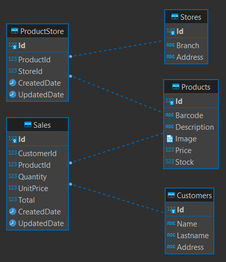
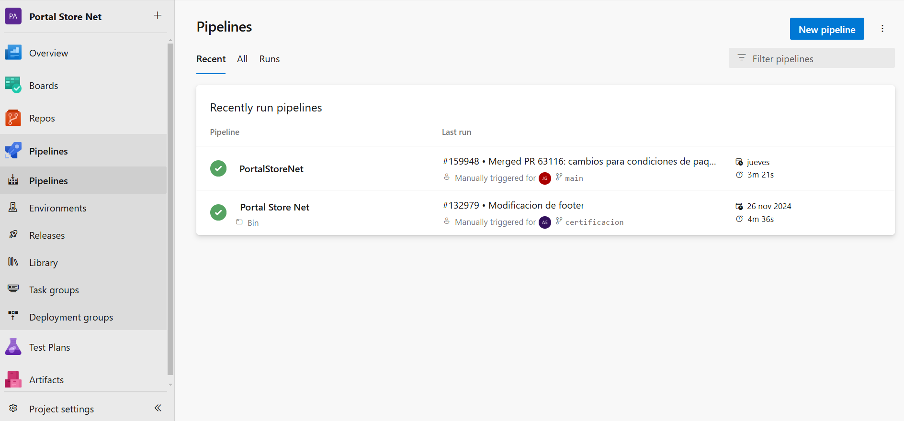
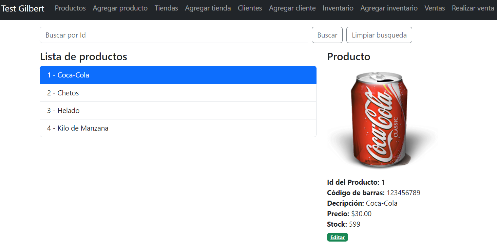
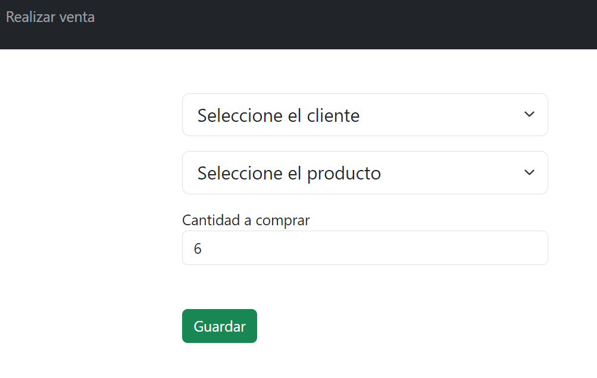
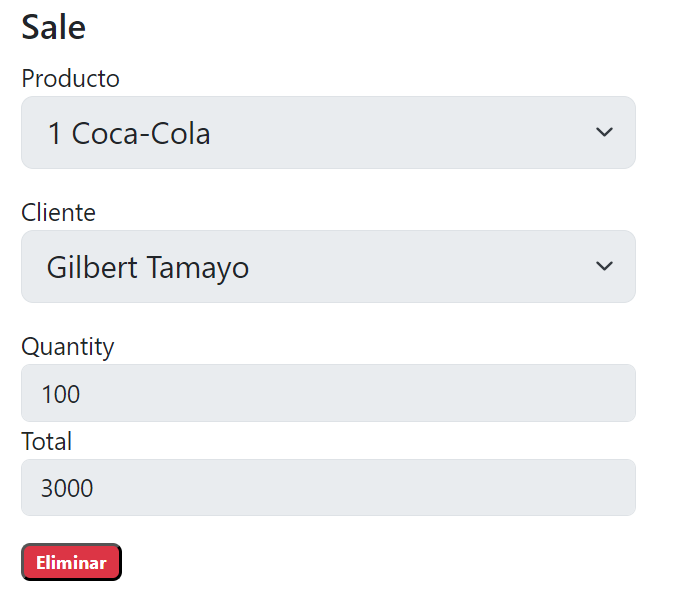

# README

Este README describe el proyecto, asi como la puesta en marcha de la aplicación.

# Repositorio de evaluación

Este repositorio fue hecho con la finalidad de ayudar en el proceso de evaluación para la vacante de desarrollador Full Stack Developer.

# NOTA

Esta implementacion fue basa en dos propuestas de trabajo, por lo que uno fue hecho por SQL Server(contenido en la rama ProductionSqlServer) y otro por PostgreSQL(contenido en main y ProductionPostgreSql), cabe destacar que se realizó la migracion de sql server a postgresql, junto con los scripts y configuraciones necesarias para su correcto funcionamiento. Por lo que el proyecto puede estar distinto al propuesto, ya que por tiempo en el desarrollo de los dos, se tuvo que realizar uno base.

### Diseño y arquitectura.

Para este proyecto se baso en los requerimientos de la evaluación, tomando en cuenta la arquitectura en 3 capaz:
- Presentación
- Negocio
- Acceso a datos

Esta arquitectura nos permite la separacion en niveles, por lo cual cada nivel se ejecuta en su propia infraestructura, pudiendo escalar o actualizar según sea necesario.

Tambien basta destacar que el proyecto esta desarrollado en base a los siguientes patterns:
- Repository: Se aplicó dicho pattern para poder tener un código separado y mantenible entre las capas de acceso a datos y la lógica de negocios de la aplicación.
- Unit of Work: Nos permite manejar todas las transacciones en la manipulación de los datos con la ayuda del pattern repository.
- DTO (Data Transfer Object): Contiene bondades que nos permite crear objectos con solamente propiedades necesarias en la cual funcione de capa intermedia entre las entidades de dominio y nuestro cliente API.

En cuestión de la data se aplicó el enfoque Database First, en la cual la base de datos se estructura en base al siguiente diagrama de ER:



### Principales Librerias y Framewoks Usados.

## Frontend

**Angular 16**: Por requerimientos de la evaluación, el proyecto Frontend esta desarrollado en base al framework de Angular.

**Bootstrap 5 para Angular**: Nos ofrece un repositorio repleto de clases CSS, que por consiguiente nos permite diseñar componentes web personalizados. Por estas ventajas descritas es que se incluyó en el proyecto.
[**https://getbootstrap.com/docs/5.0/getting-started/introduction/)

**Typescript**: Nos brinda a nuestro proyecto un mejor orden en cuestion de tipado y detectar rapidamente errores en nuestro editor.

## Backend

**Net Core 7**: Por requisitos de la evaluación, el proyecto Backend esta desarrollado en base al framework Net Core version 7.

**Entity Framework Core**: Se hizo uso de esta librería para un ORM en la aplicación.

**PostgreSQL**: Lo incluimos como base de datos para desarrollo de las API´s, PostgreSQL nos permite consultar datos con una reputación de su velocidad, fiabilidad, compatibilidad, por lo que se adapta al desarrollo backend para este proyecto en particular.

**AutoMapper**: Es una herramienta muy util que nos resuelve el mapeo de las nuestras entidades del proyecto.

### Requisitos para backend

** .NET SDK  7 **
** PostgreSQL 17.3 **

### Deploy Backend

En nuestro servidor podemos realizar el deploy en base a Docker con Docker Compose, usando el (dockerfile, docker-compose, etc) alojado en StoreNet.API, debe ejecutar el siguiente comando estando en la ruta comentada:

```
docker-compose up -d
//Ver contenedores
docker ps
//Ver logs
docker logs [id-contenedor]
```

### Requisitos para frontend

**Nodejs**: Se probó con la versión 16.14.0, sino cuenta con alguno, se sugiere usar NVM para usar multiples versiones.

**NPM**: Se probó con la versión 8.6.0

### Deploy Frontend
Podemos compilar con el siguiente script(debe tener en cuenta la configuracion de la ruta de la api en los environments files):

```
npm run build
```

De ahi podemos configurar nuestro servidor con el servicio de Nginx, parecido a esta configuracion:

server {
    listen 80;
    server_name netstore.com www.netstore.com;

    # Define the root directory for your static files
    root /var/www/mysitenetstore/static;

    location / {
        try_files $uri $uri/ =404;
    }

    access_log /var/log/nginx/netstore.com.access.log;
    error_log /var/log/nginx/netstore.com.error.log;

}

### Deploy Recomendado en ambos (back y front)

Se puede usar Azure con la integración continua (CI/CD) en base a los pipelines, por lo que nos garantiza la acelaración del desarrollo y tener el codigo siempre disponible en nuestros entornos.



### Instalación

1.- Clone el repositorio

```
git clone https://github.com/kevbrygil/StoreNet.git
```

2.- Dirijase a la carpeta StoreNet.Infrastructure/Data/StoreNet.Database.sql.

3.- Ejecute el script SQL en su entorno PostgreSQL (Esto creará la base de datos y datos de prueba).

4.- Dirijase a la carpeta StoreNet.Frontend e instale las librerias necesarias para la aplicacion web.

```
cd StoreNet.Frontend/
npm install
```

5.- Dirijase al secrets.json del proyecto StoreNet.API y agregue la cadena de conexión de la base de datos.
```
{
  "ConnectionStrings": {
    "StoreNetDB": "****cadena de conexión****"
  }
}
```

6.- Establezca StoreNet.API como proyecto de inicio y ejecute la web API.
```
dotnet run
```

7.- Dirijase al archivo StoreNet.Frontend/src/environments/environment.ts y agregue la ruta de la API de la aplicación (la variable debe llamarse urlBackend)

```
export const environment = {
  production: false,
  urlBackend: '****ruta****'
};
```

8.- Ejecute la web app en la consola

```
cd StoreNet.Frontend
ng serve -o
```
ó tambien:

```
cd StoreNet.Frontend
npm run start
```

9.- Acceder al sitio localmente

```
http://localhost:4200/
```

10.- Iniciar sesión o registrarse

Por falta de tiempo no se implemento la autentificación, pero se pensaba usar el estándar JWT y asi tener un inicio de sesión y navegación de manera segura.

### Explicación de la interfaz

#### Pantalla inicio

Desde aqui puedes ver la lista de todos los productos y buscarlos por su Id. Asi como editarlos y en su caso Eliminarlos.
Cabe mencionar que para la creación del producto no se implemento el anexo de la imagen en frontend, pero si esta implementado en el backend.



De igual manera siguiendo la dinámica, se puede:

- Listar/Modificar/Eliminar Tiendas
- Agregar Tienda
- Listar/Modificar/Eliminar Clientes
- Agregar Clientes
- Listar/Modificar/Eliminar Inventario
- Agregar Inventario
- Listar/Eliminar ventas (Aqui no se puede modificar solo eliminar)
- Realizar venta

#### Pantalla de realizar ventas y eliminarlas

Aquí se puede realizar una venta. Basta indicar los siguientes puntos para esta pantalla:

-   El usuario puede crear una venta de un producto siempre y cuando se tenga disponible en el stock.
-   Se rechaza la venta si la cantidad del producto requerida rebasa el stock del producto.
-   Si se elimina una venta, se anexa la cantidad de la venta al stock del producto relacionado.



